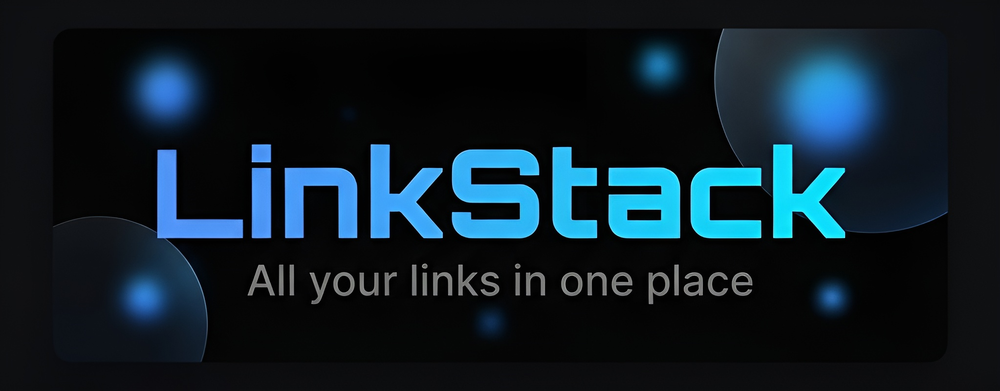

<p align="center">
  
</p>

<p align="center">
  <strong>Tu propio Linktree — gratuito, seguro y open source.</strong><br>
  Todos tus enlaces profesionales en un solo lugar, con diseño premium y arquitectura blindada.
</p>

<p align="center">
  <a href="#-características"></a>
  <a href="LICENSE"></a>
  <a href="#-tech-stack"></a>
  <a href="#-tech-stack"></a>
</p>

---

## 📋 Descripción

**LinkStack** es una alternativa open-source a Linktree, construida con HTML, CSS y JavaScript puro (sin frameworks). Permite a cualquier persona crear su página de enlaces personalizada con:

- 🎨 Diseño **Glassmorphism** premium
- 🔐 Seguridad de nivel empresarial (XSS-proof, transacciones atómicas)
- 📱 100% responsivo (Desktop, Tablet, Móvil)
- ☁️ Subida de imágenes segura via Cloudflare Workers
- 🚀 Deploy gratuito en GitHub Pages

---

## ✨ Características

| Característica | Descripción |
|---|---|
| 🔗 **Gestión de Enlaces** | Crea, elimina y organiza hasta 20 enlaces con íconos personalizados |
| 👤 **Perfil Público** | Nombre, bio, foto de perfil y URL personalizada (`/linkstack/?u=tu_nombre`) |
| 🖼️ **Galería de Fotos** | Sube hasta 30 imágenes a tu muro público |
| 🎬 **YouTube Embed** | Los enlaces de YouTube se renderizan automáticamente como reproductores |
| 🎨 **Temas Visuales** | 3 paletas premium: Basalto, Nebula y Midnight |
| 📱 **WhatsApp Linker** | Genera enlaces de WhatsApp con mensaje predefinido |
| 🔐 **Auth Completo** | Registro, login, verificación de email, cambio de contraseña |
| 🛡️ **Anti-XSS** | Sanitización completa de todos los datos renderizados |
| 🏷️ **Usernames Atómicos** | Transacciones Firestore que impiden colisiones de nombres |
| 🔑 **Firebase ID Tokens** | Subida de imágenes autenticada con tokens dinámicos |
| 📦 **Zero Dependencies** | HTML + CSS + JS puros. Sin npm, sin build, sin frameworks |
| ⚡ **Deploy Instantáneo** | Solo sube los archivos a GitHub Pages y funciona |

---

## 🛠️ Tech Stack

| Capa | Tecnología |
|---|---|
| **Frontend** | HTML5, CSS3 (Glassmorphism), JavaScript ES6+ |
| **Auth & DB** | Firebase Authentication + Cloud Firestore |
| **Imágenes** | Cloudflare Workers (proxy) → ImgBB (almacenamiento) |
| **Íconos** | Lucide Icons |
| **Fuentes** | Inter + Space Grotesk (Google Fonts) |
| **Hosting** | GitHub Pages (gratuito) |

---

## 🚀 Instalación

### 1. Clonar el repositorio

```bash
git clone https://github.com/armandogg24/LinkStack.git
cd LinkStack
```

### 2. Configurar Firebase

1. Crea un proyecto en [Firebase Console](https://console.firebase.google.com/)
2. Activa **Authentication** (Email/Password)
3. Activa **Cloud Firestore**
4. Copia tu configuración y pégala en `firebase-config.js`:

```javascript
const firebaseConfig = {
  apiKey: "TU_API_KEY",
  authDomain: "tu-proyecto.firebaseapp.com",
  projectId: "tu-proyecto",
  storageBucket: "tu-proyecto.firebasestorage.app",
  messagingSenderId: "123456789",
  appId: "1:123456789:web:abcdef"
};
```

### 3. Configurar Reglas de Firestore

En la consola de Firebase → Firestore → Reglas, pega:

```
rules_version = '2';
service cloud.firestore {
  match /databases/{database}/documents {
    match /users/{userId} {
      allow read: if true;
      allow create: if request.auth != null && request.auth.uid == userId
                    && request.resource.data.username is string
                    && request.resource.data.username.size() >= 3;
      allow update, delete: if request.auth != null && request.auth.uid == userId;
    }
    match /usernames/{username} {
      allow read: if true;
      allow create: if request.auth != null && request.resource.data.uid == request.auth.uid;
      allow delete: if request.auth != null && resource.data.uid == request.auth.uid;
    }
  }
}
```

### 4. Configurar Cloudflare Worker (Subida de Imágenes)

1. Crea un Worker en [Cloudflare Dashboard](https://dash.cloudflare.com/)
2. Guarda tu API Key de ImgBB como secret: `wrangler secret put IMGBB_API_KEY`
3. Actualiza la URL del Worker en `dashboard.js` línea 3

### 5. Abrir localmente

Abre `index.html` con Live Server (VS Code) o cualquier servidor local. ¡Listo!

---

## 📁 Estructura del Proyecto

```
LinkStack/
├── index.html          # Punto de entrada principal
├── style.css           # Diseño Glassmorphism completo
├── firebase-config.js  # Configuración Firebase + utilidades de seguridad
├── auth.js             # Login, registro y verificación de email
├── dashboard.js        # Panel de control con sistema de pestañas
├── profile.js          # Renderizado del perfil público (sanitizado)
├── app.js              # Enrutador y listener de auth
├── banner.png          # Banner del README
├── LICENSE             # MIT License
└── .gitignore
```

---

## 🔒 Seguridad

LinkStack ha pasado por una **auditoría de seguridad multicapa** que incluye:

- ✅ **Anti-XSS**: `escapeHTML()` en todos los puntos de renderizado
- ✅ **Anti-Inyección URL**: `safeURL()` bloquea protocolos `javascript:` y `data:`
- ✅ **Anti-Inyección de Atributos**: `safeIcon()` valida nombres de íconos
- ✅ **Validación de Archivos**: Solo JPG, PNG, GIF, WebP (máx. 5MB)
- ✅ **Transacciones Atómicas**: Los usernames se reservan sin posibilidad de colisión
- ✅ **Firebase ID Tokens**: Las subidas de imágenes requieren autenticación dinámica
- ✅ **YouTube Sandbox**: Los iframes embebidos tienen restricciones de seguridad
- ✅ **Cloudflare Proxy**: La API Key de ImgBB nunca toca el navegador del usuario

---

## 🤝 Contribuir

¡Las contribuciones son bienvenidas! Si quieres mejorar LinkStack:

1. Haz fork del repositorio
2. Crea una rama para tu feature (`git checkout -b feature/mi-mejora`)
3. Haz commit de tus cambios (`git commit -m 'Añadir mi mejora'`)
4. Haz push a la rama (`git push origin feature/mi-mejora`)
5. Abre un Pull Request

---

## 📄 Licencia

Este proyecto está bajo la licencia **MIT**. Consulta el archivo [LICENSE](LICENSE) para más detalles.

---

<p align="center">
  Hecho con 💙 por <a href="https://github.com/armandogg24">Armando González</a>
</p>
